# RideAlong : Cycle Together

## Description

This project's goal is to create a platform where people can make bicycle reservations and specify meetup dates to ride bicycles in groups.

## Instructions

First of all, clone this repository

    git clone https://github.com/mohammed-eddaghal/RideAlong.git

### Running the code locally from source

There are three things that need to be running in order to execute the whole application.

- **Postgres Database** (Make sure you edit *application.properties* with the right credentials so that the backend can detect your database)
- **JDK 11** (An IDE like intellij or eclipse will do the work automatically for you)
   
        # Windows
        gradlew bootRun
        # Linux
        ./gradlew bootRun
- **Node and npm**

        npm install
        npm run dev

## Database Schema

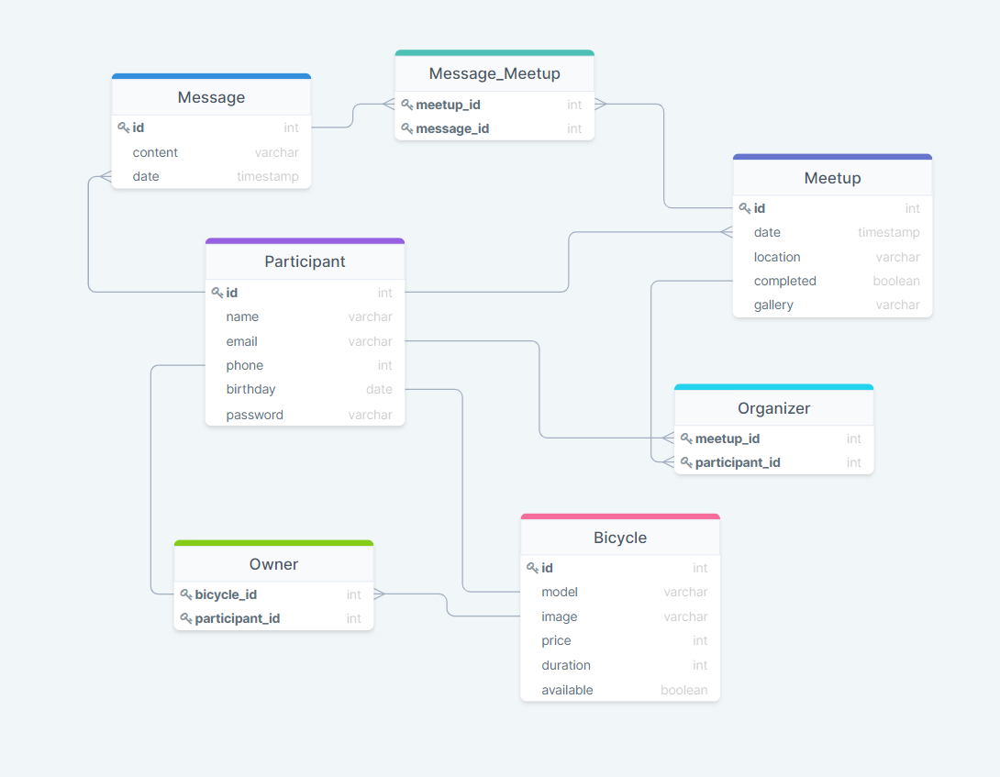

## App Overview
### Homepage

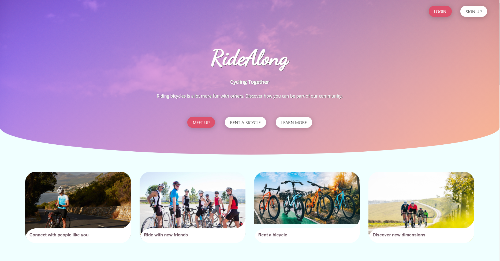

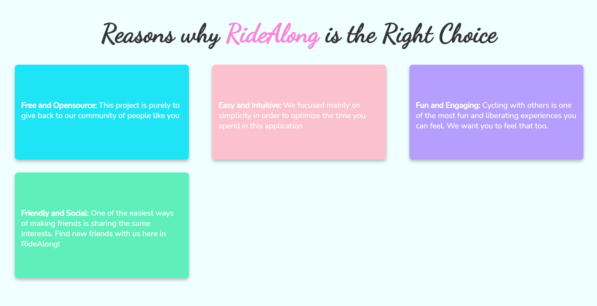

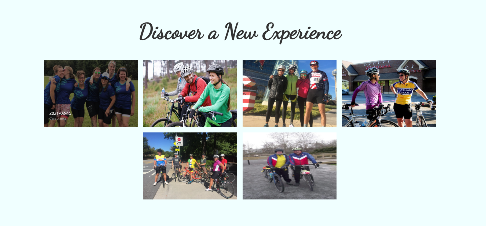

### Sign up page

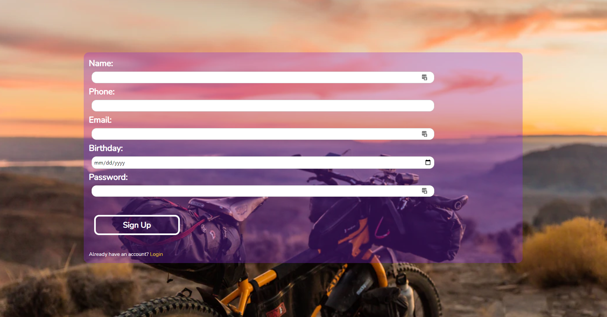

### Login page

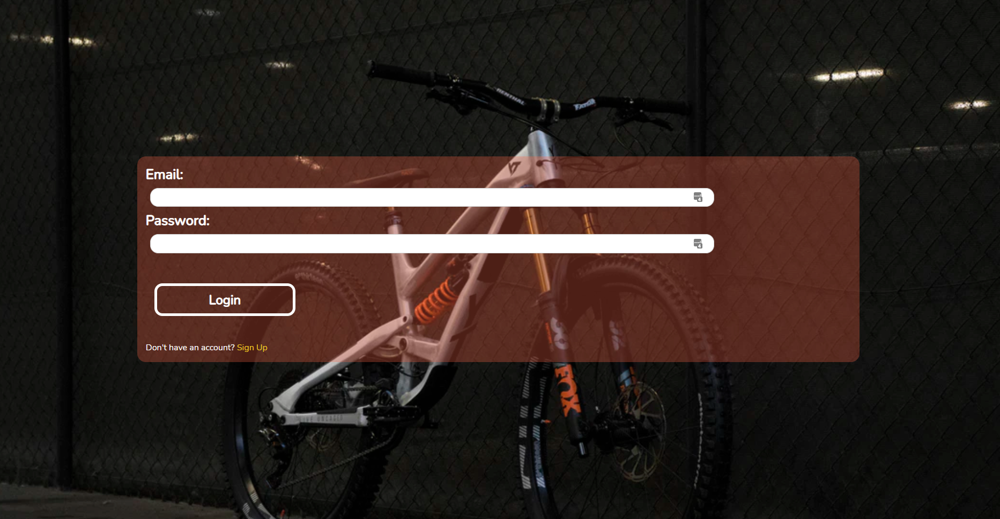

### Dashboard: Meetups View

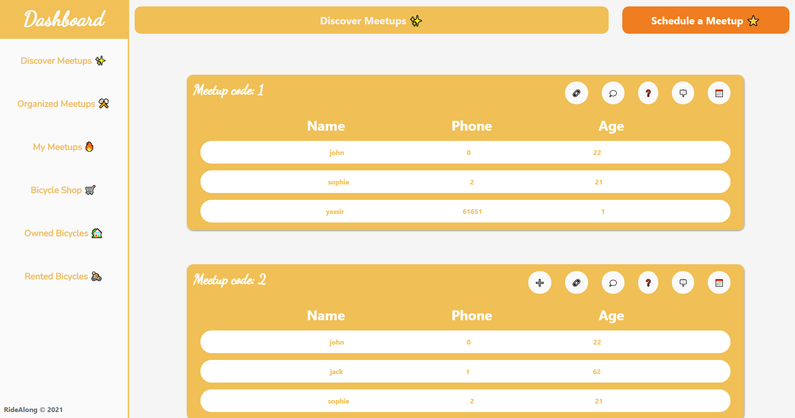

### Meetup card options

- **➕ Add Button:** Join meetup
- **🔗 Link Button:** Link to gallery where meetup photos are uploaded. It will often be a link to Google Drive.
- **💭 Chat Button(Coming soon):** Open chat modal to talk with people and discuss information related to the meetup.
- **❓ Question Mark Button:** Check if the meetup has ended or not.
- **🪧 Sign Button:** See the location of the meetup
- **📅 Calendar Button:** See the date of the meetup

### Scheduling a meetup modal

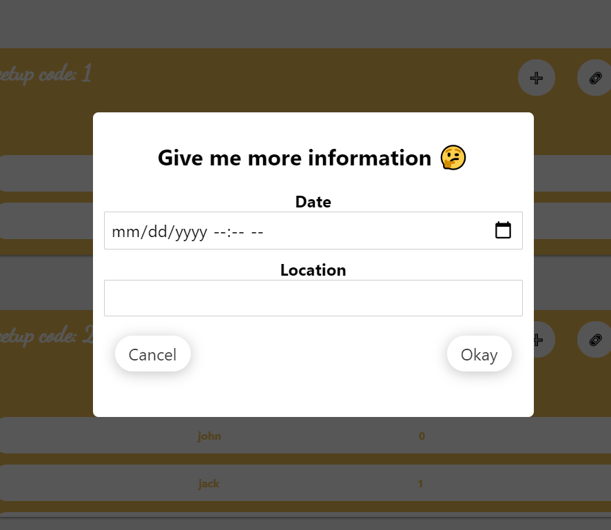

### Dashboard: Bicycles View

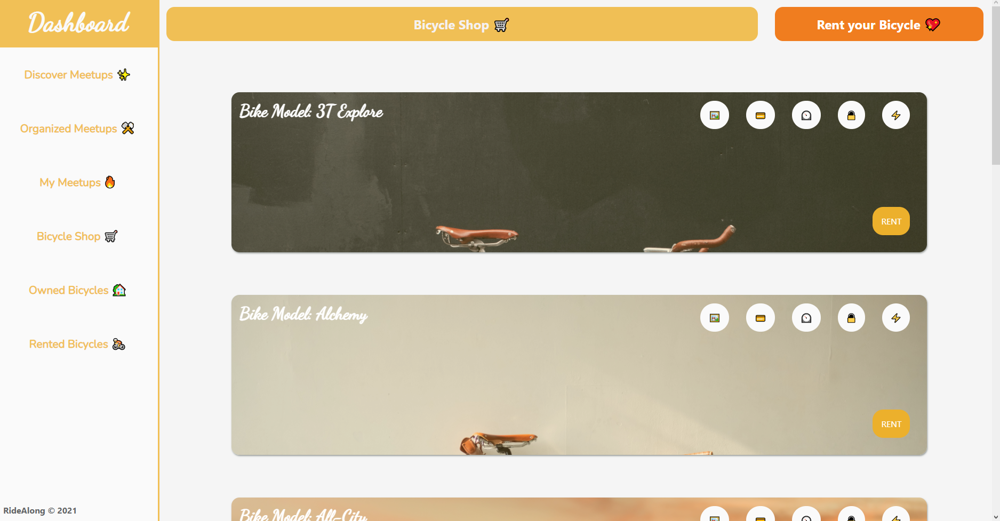

### Giving your bicycle up for rent modal

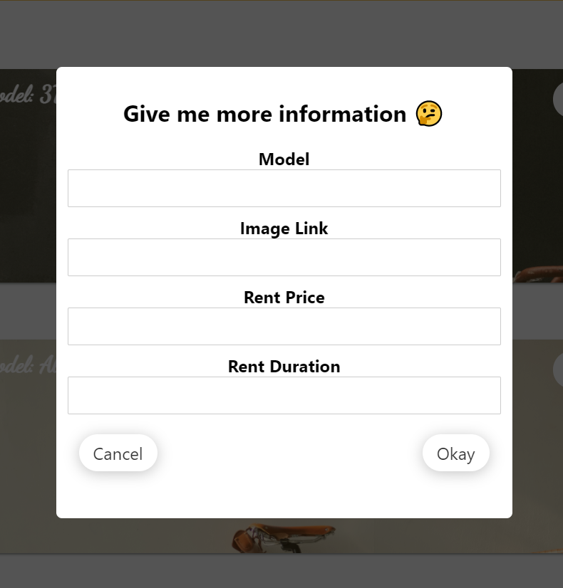

### Bicycle Card

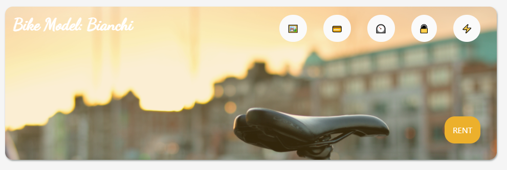

- **🖼️ Picture Button:** See the whole picture of the bicycle in a new tab.
- **💳 Credit Card Button:** Check the price of the bicycle for which you can be able to rent it.
- **⏲️ Timer Button:** Know how long you can rent this bicycle (in days quantity)
- **🔒 Lock Button:** Is the bicycle available or not.
- **⚡ Electricity Button:** See the owner's name.

 
 

## <h1>The Mission of RideAlong</h1>

<pre>

This project's aim is to create a tool for cyclists to make their hobbies easier and more engaging. 
We noticed that in our local community, people were using the mobile application WhatsApp to schedule
their meetups. This solution is acceptable in its own right, but we envisioned a better solution to
help them avoid the many problems that they were facing.

When using a regular group, there was a risk of not synchronizing in the time of meetings. This would
lead to some people unable to join because the group has already departured. With our application, by using
a postgres database, a springboot backend, and a svelte UI, we can organize the way people meet up and
help them ensure that nobody is left behind.

Furthermore, this application will enable the creation of many communities at once and make the process of
joining them more open and available. This is a far better solution than creating dozens of WhatsApp groups.

We also thought of people who don't have a bicycle to participate. Our application offers the possibility of
renting bicycles from the community for the community.

We really hope that you like our work, Made with 💖 by some ensias students.
</pre>
